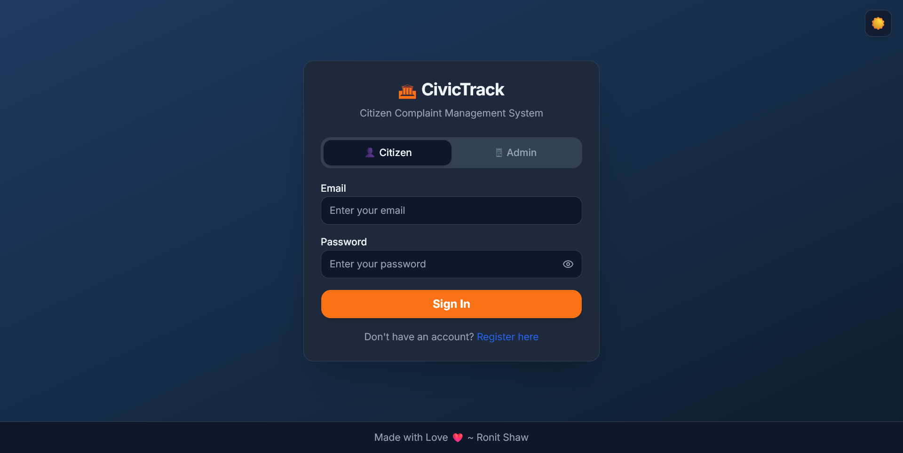
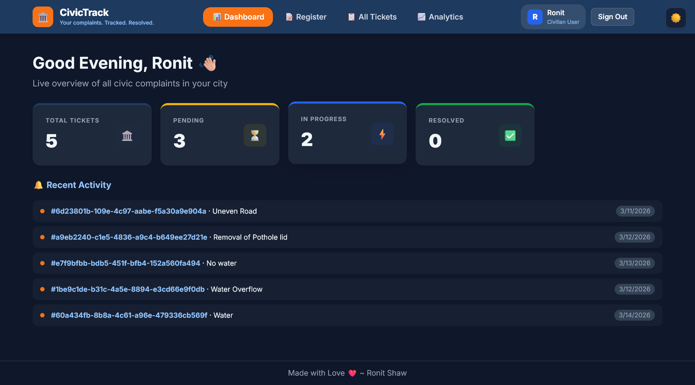
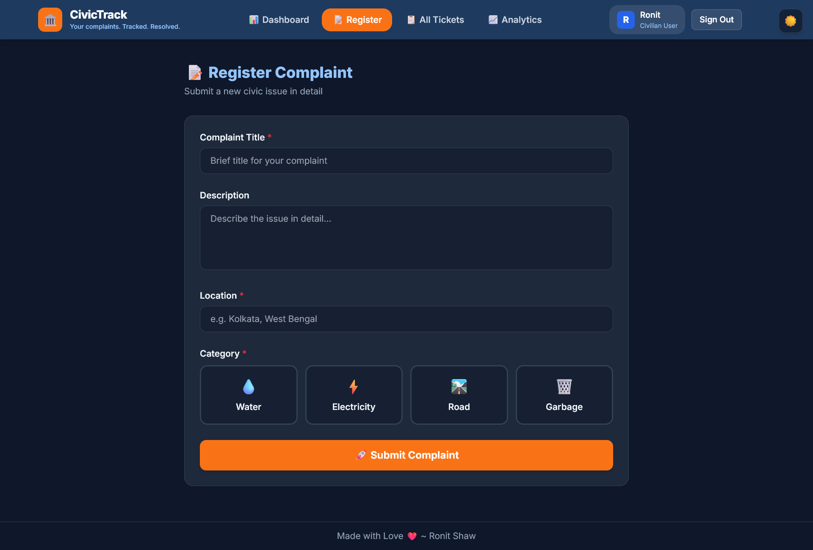
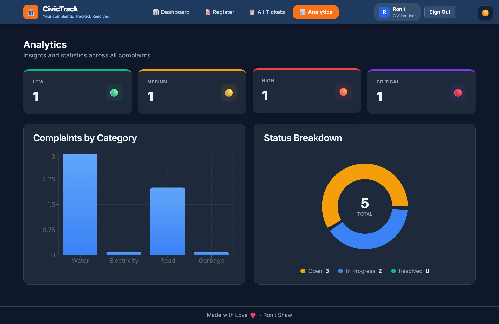
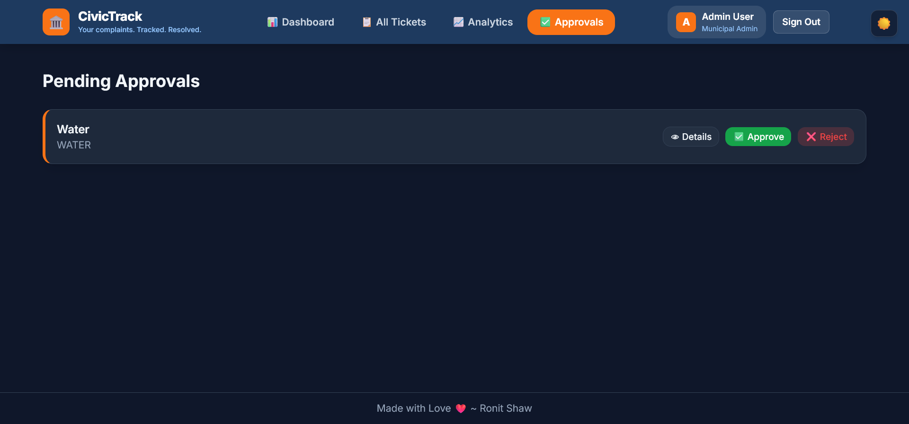

# CivicTrack Frontend

A modern, responsive frontend for CivicTrack - a civic complaint management system. Built with Next.js, TypeScript, and Tailwind CSS, featuring real-time updates and role-based access control.


## Features

- **Authentication Flow**: Secure login/register with role-based access (Citizen & Admin)
- **Dashboard**: Real-time statistics and activity feed
- **Complaint Submission**: Easy-to-use form for submitting civic complaints
- **Ticket Tracking**: View and track status of submitted complaints
- **Real-time Updates**: Live notifications via Server-Sent Events (SSE)
- **Role-based UI**: Different interfaces for Citizens and Administrators
- **Responsive Design**: Works on desktop and mobile devices

## Tech Stack

- **Framework**: Next.js 15 (App Router)
- **Language**: TypeScript
- **Styling**: Tailwind CSS + shadcn/ui
- **State Management**: TanStack Query (React Query)
- **Form Handling**: React Hook Form + Zod validation
- **HTTP Client**: Axios with JWT interceptors
- **Real-time**: Server-Sent Events (SSE)
- **Deployment**: Vercel

## Folder Structure

```
civictrack-frontend/
├── src/
│   ├── app/                    # Next.js App Router pages
│   │   ├── login/             # Login page
│   │   ├── register/          # Citizen registration
│   │   ├── register-complaint/ # Submit complaint
│   │   ├── dashboard/         # User dashboard
│   │   ├── tickets/           # Ticket list
│   │   │   └── [id]/          # Ticket detail
│   │   ├── analytics/         # Admin analytics
│   │   ├── approvals/         # Admin approvals
│   │   ├── page.tsx           # Landing page
│   │   └── layout.tsx         # Root layout
│   ├── components/
│   │   ├── ui/               # shadcn/ui components
│   │   │   ├── button.tsx
│   │   │   ├── card.tsx
│   │   │   ├── input.tsx
│   │   │   └── ...
│   │   ├── layout/           # Layout components
│   │   │   ├── AppLayout.tsx
│   │   │   └── Navbar.tsx
│   │   ├── tickets/          # Ticket components
│   │   │   ├── TicketTable.tsx
│   │   │   ├── TicketDetail.tsx
│   │   │   └── TicketCard.tsx
│   │   ├── dashboard/        # Dashboard widgets
│   │   │   ├── StatCard.tsx
│   │   │   └── ActivityFeed.tsx
│   │   └── shared/           # Shared components
│   │       ├── Badge.tsx
│   │       ├── ThemeToggle.tsx
│   │       └── Toast.tsx
│   ├── hooks/                # Custom React hooks
│   │   ├── useAuth.ts        # Authentication hook
│   │   ├── useTickets.ts     # Ticket management
│   │   └── useSSE.ts         # SSE connection
│   ├── lib/                  # Utilities
│   │   ├── api.ts            # Axios API client
│   │   ├── auth.ts           # Auth helpers
│   │   ├── queryClient.tsx   # React Query setup
│   │   └── utils.ts          # Helper functions
│   └── types/                # TypeScript types
│       ├── index.ts
│       └── ticket.ts
├── public/                   # Static assets
├── .env.local               # Environment variables
├── next.config.ts
├── tailwind.config.ts
└── package.json
```

## Local Setup

```bash
# Clone the repository
git clone https://github.com/beingRonit/civictrack-frontend.git
cd civictrack-frontend

# Install dependencies
npm install

# Create environment file
echo 'NEXT_PUBLIC_API_URL=http://localhost:5000/api' > .env.local

# Start development server
npm run dev
```

## Environment Variables

Create a `.env.local` file:

```env
# Backend API URL (point to Railway or local server)
NEXT_PUBLIC_API_URL=http://localhost:5000/api

# Google Maps API Key (optional - for location features)
NEXT_PUBLIC_GOOGLE_MAPS_API_KEY=your-google-maps-api-key
```

## Pages Overview

| Page | Route | Description |
|------|-------|-------------|
| Landing | `/` | Home page with app info |
| Login | `/login` | User authentication (Citizen/Admin tabs) |
| Register | `/register` | New citizen registration |
| Dashboard | `/dashboard` | User's tickets and stats |
| Submit Complaint | `/register-complaint` | File a new complaint |
| Tickets | `/tickets` | View all tickets |
| Ticket Detail | `/tickets/[id]` | Single ticket view |
| Analytics | `/analytics` | Admin: system analytics |
| Approvals | `/approvals` | Admin: pending approvals |

## Key Components

- **AuthFlow**: Login/Register with role tabs
- **TicketCard**: Compact ticket display
- **TicketTable**: Detailed ticket listing
- **ActivityFeed**: Real-time activity stream
- **StatCard**: Dashboard statistics
- **ThemeToggle**: Light/Dark mode switch

## Deployment (Vercel)

1. **Push code to GitHub**
2. **Go to [vercel.com](https://vercel.com)** and import the repository
3. **Configure environment variables**:
   - `NEXT_PUBLIC_API_URL` = your Railway backend URL (e.g., `https://civictrack-backend-production.up.railway.app/api`)
   - `NEXT_PUBLIC_GOOGLE_MAPS_API_KEY` = your Google Maps API key (optional)
4. **Deploy** - Vercel will automatically build and deploy
5. **Add your Vercel URL** to Railway's `FRONTEND_URL` variable

## Screenshots

> **Login Page**
> 

> **Dashboard**
> 

> **Submit Complaint**
> 

> **Analytics**
> 

> **Admin Approvals**
> 

## Connecting to Backend

The frontend connects to the Railway-deployed backend. Make sure:

1. Backend is deployed on Railway
2. `NEXT_PUBLIC_API_URL` in Vercel points to Railway backend
3. `FRONTEND_URL` in Railway points to Vercel frontend

---

Built with ❤️ using Next.js and shadcn/ui
